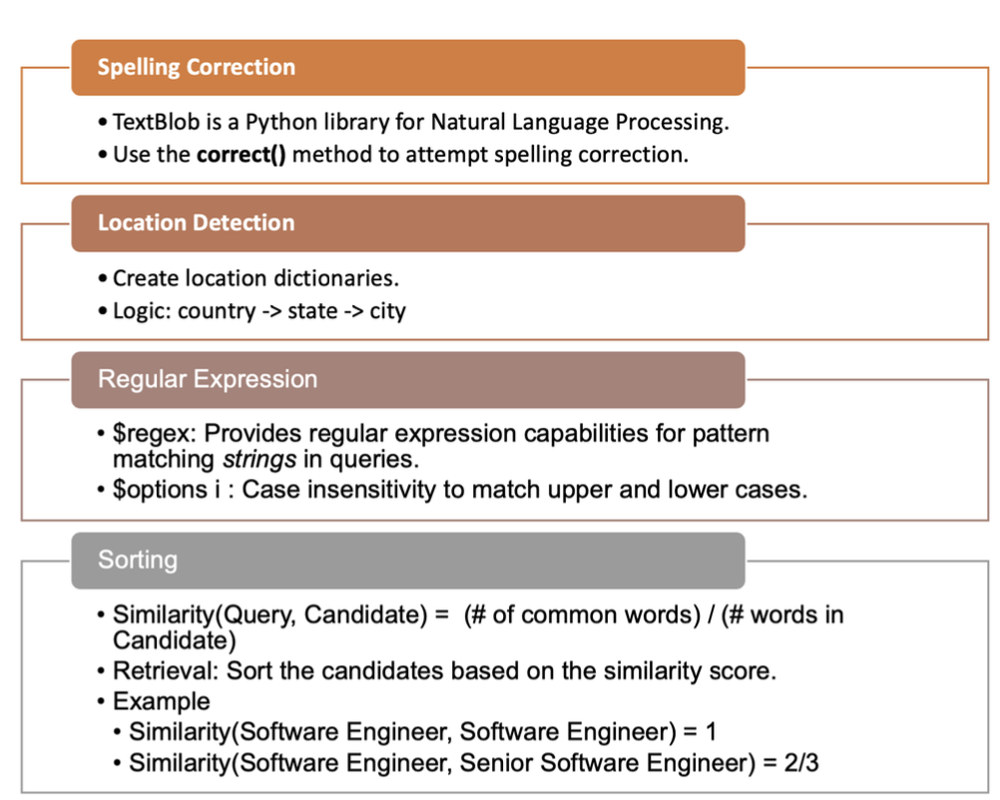

- [Intro](#intro)

- [ETL](#etl)

- [Job Search](#job-search)

- [Job Recommend](#job-recommend)

- [Front End](#front-end)

  
## [Intro](#intro)
- Scrapped 1000+ data from LinkedIn, Glassdoor, etc in Python using Scrapy and built ETL using Apache Airflow to integrate data daily
- Implemented recommendations by scores and locations utilizing SparkDF, SparkSQL, and Haversine lib
- Implemented recommendations by users' information using sentence transformer, Bert and SparkMLlib
- Integrated real-time recommendation using Kafka to transfer data to SparkStreaming and save to Redis
- Designed front-end user interface and data visualization interface in JavaScript using React, Flask, and Echarts
- Realized fuzzy search using textblib lib, regular expression, and sorting by similarity

## [ETL](#etl)

  

## [Job-Search](#job-search)

  

## [Job Recommend](#job-recommend)

  

## [Front-End](#frontend)

  

    
    <a href="https://github.com/PeiqiChen/BigData">Job Search Website</a>

