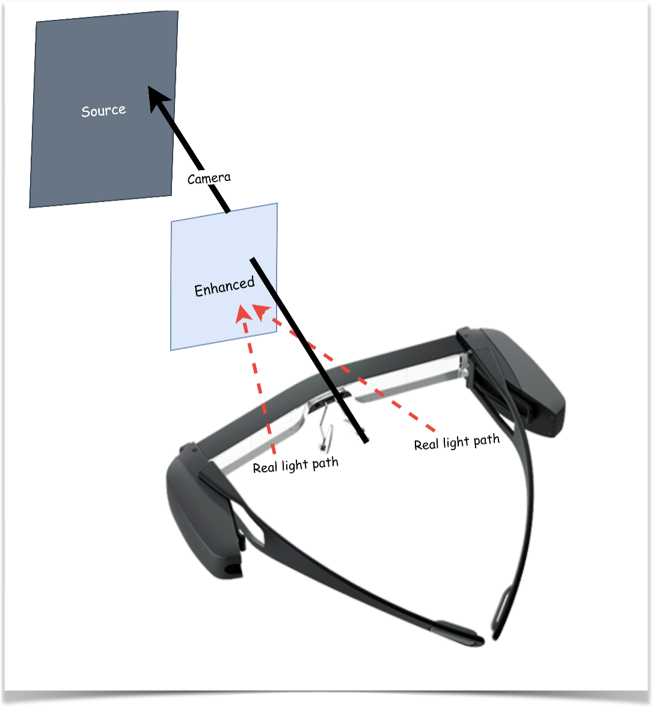

### Enhance night vision to day vison

### Intro

In this project we use cycleGAN to generate day images based on night images in real-time. We also developed an Android app for this project. It could be used on PC, mobile phones and AR glasses.

### Demo

    
    

### Methods

- Multi-Scale FFT Semantic Extractor

  

- Core algorithms

| **Core Techniques**                                        | **Advantages**                                                                                                                                                   |
| ---------------------------------------------------------------- | ---------------------------------------------------------------------------------------------------------------------------------------------------------------------- |
| CycleGAN+featureGAN                                              | After enhancement, the original image features can still be retained.                                                                                                  |
| Multi- scale FFT semantic extractor (novel）                     | Introduce loss function in the image frequency domain to improve semantic consistency.                                                                                 |
| Compress the model via once-for-all algorithm.                   | Cut unnecessary connections in the model, greatly reduce the computing resources occupied by the model, and can run on platforms such as mobile phones and AR glasses. |
| Complete mobile platform tensor and image conversion API (novel) | Real-time transform the tensors output by the model into images on the mobile side and enhance the images.                                                             |
| Danger warning                                                   | Frame nearby dangerous vehicles in red via object recognition model and depth estimation algorithm.                                                                    |

### Results

  

: https://github.com/SilenceMonk/Night-Vision-Enhancement-App-for-AR-devices
