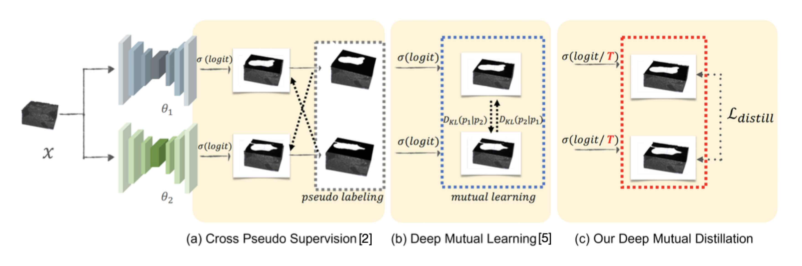
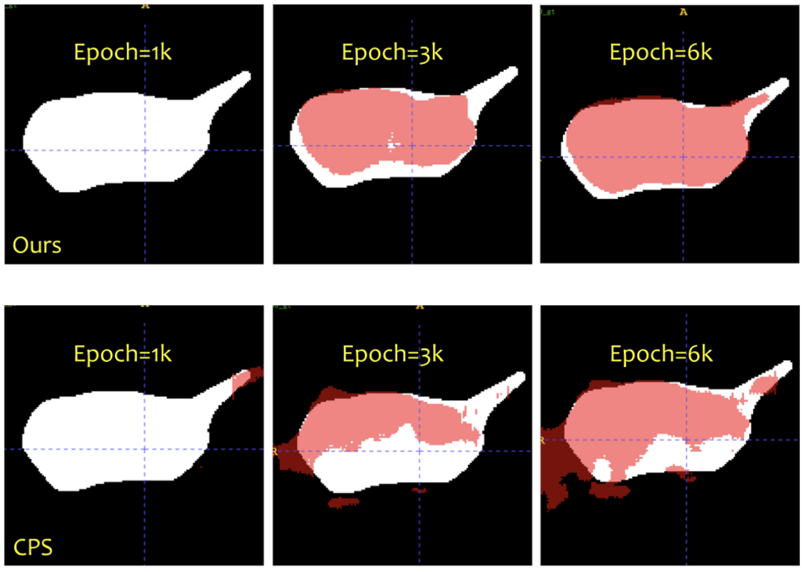
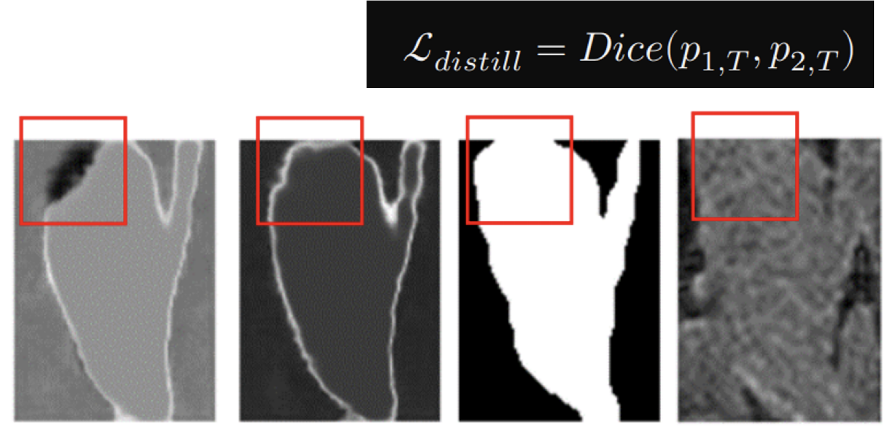
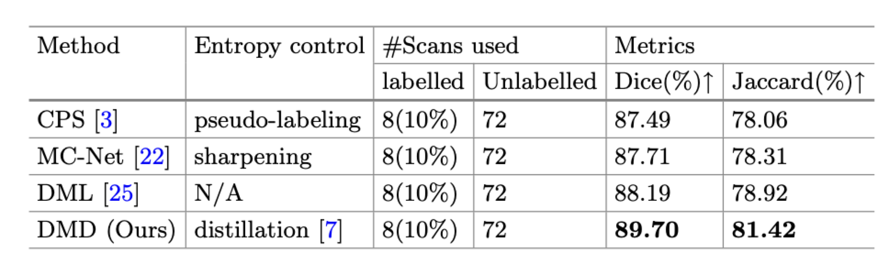

### Intro

Proposed a novel semi-supervised method called Deep Mutual Distillation for accurately segmenting the atria in cardiac MRI images, achieving state-of-the-art performance on benchmark datasets.

### Methods

   

**Mutual Knowledge Distillation**

- Distill knowledge from each other
- Increase temperature above 1.0 to enhance entropy and exploration
- Utilize Dice loss to address class imbalance issues

### Results

  
  
  

### [Paper](https://link.springer.com/chapter/10.1007/978-3-031-43898-1_52)
