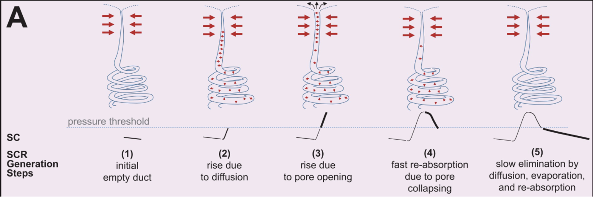
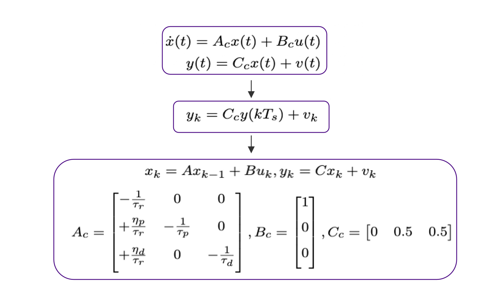
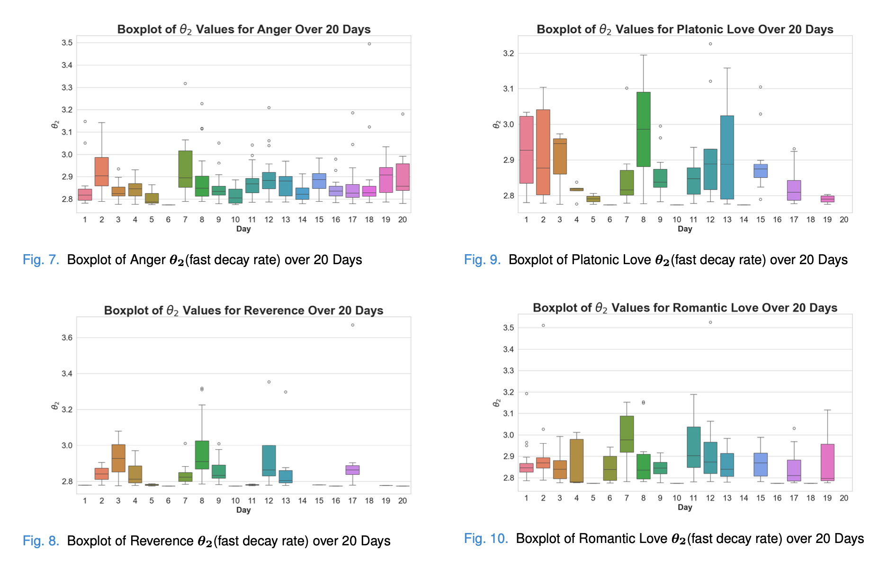
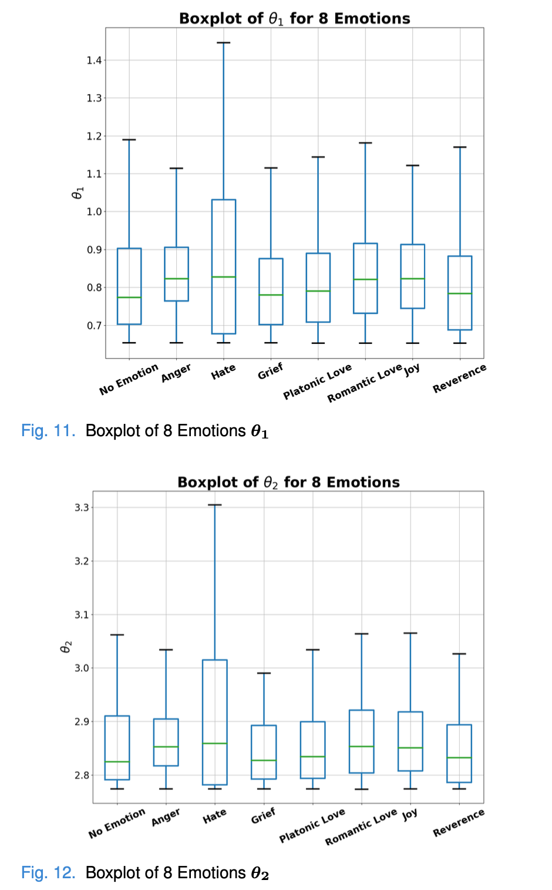

### Intro

Emotions are some strange but also beautiful things for human beings. It could generate art but also even hurt human beings. So, in our projects, we want to use the physiology of human beings(electrodermal signal) to figure out more about emotions.

### Methods

    

- **Sweat secretion model**

  

The sweat secretion will affect the skin conductance measurement. So we built our model based on the sweat secretion model.

The state space model is :

  

- **Parameter Estimation**(Expectation Maximization)
  - E-step
  - M-step
  - Parameter Re-estimation
    - **Re-estimate Window** Setting
    - **Random Gaussian Initialization** with selected Mean and Variance for each arousal event
    - **Setting** Θ3 as a constant, and then re-estimate Θ1 and Θ2

  `

### Statistical Analysis

- Deconvolution results

  

- Boxplots for different emotions

  
   
 

- L-Norm

  

### Conclusion

1) High θ1 and θ2 and highest L0, L1, L2 norm ⇒ Anger 

2) High θ1 and θ2 and lowest L0, L1, L2 norm ⇒ Hate 

3) Lowest θ1 and θ2 ⇒ No emotion

For the remaining emotions (Grief, Platonic Love, Romantic Love, Joy, Reverence):

1) High θ1 and θ2 and highest L0, L1, L2 norm ⇒ Joy

2) Low θ1 and θ2 and Lowest L0, L1, L2 norm ⇒ Reverence 

3) Grief, Platonic Love, Romantic Love, and Reverence are morechallenging to distinguish, which is consistent with the P-values
